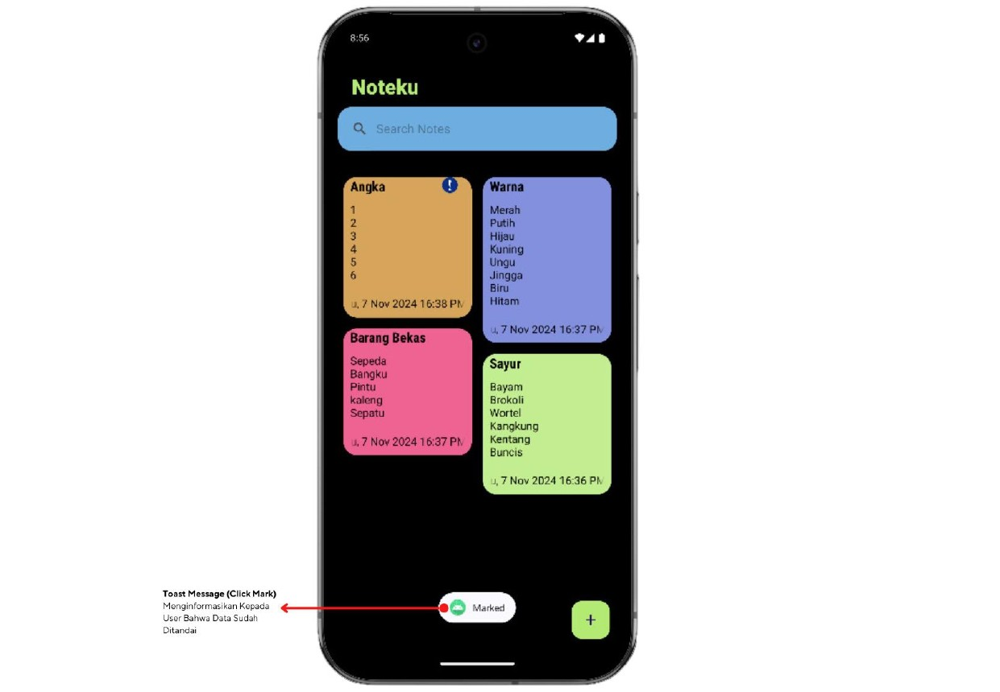

# UTS Pemrograman Mobile

### Nama : Denta Pramudya
### NIM  : 312310464
### Kelas: TI.23.A5

# Ini adalah Aplikasi **Noteku**!

Aplikasi ini dapat mencatat jadwal harian, catatan sehari-hari, dan kegiatan lainnya. Pengguna dapat membuat catatan, menandai, menghapus, mengedit, dan memfilter pencarian.

Aplikasi bisa diunduh disini : 
[Aplikasi Noteku](Noteku_Apk/Noteku.apk)

### Tujuan dari aplikasi ini:

1. Memudahkan Pencatatan Harian: Memberikan kemudahan bagi pengguna dalam mencatat dan mengatur jadwal harian serta kegiatan lainnya secara digital, menggantikan metode pencatatan konvensional.

2. Pengelolaan Catatan yang Efisien: Membantu pengguna dalam mengelola dan memantau setiap catatan melalui antarmuka yang intuitif, sehingga informasi dapat diatur dengan lebih rapi dan efektif.

3. Aksesibilitas Tinggi: Memungkinkan pengguna mengakses catatan mereka kapan saja dan di mana saja, selama terhubung dengan internet, sehingga informasi selalu tersedia saat dibutuhkan.

4. Meningkatkan Produktivitas: Dengan fitur penandaan, pengeditan, dan pemfilteran, pengguna dapat dengan mudah menemukan dan memprioritaskan catatan penting, meningkatkan efisiensi dalam kegiatan sehari-hari.

5. Mendukung Transformasi Digital: Mendorong penggunaan teknologi digital dalam kegiatan pencatatan, mengurangi ketergantungan pada media kertas, dan mendukung praktik ramah lingkungan.

## Logo Aplikasi

## 1. Storyboard

## 2. Mockup

## UI UX

## 1. Pada Main List View, terdapat kolom pencarian yaitu search notes yang bisa digunakan untuk mencari notes yang diinginkan.
## 2. Pada Search Results, berisi hasil dari pencarian yang ditulis oleh user dari search notes.
## 3. Jika menekan lama pada bagian notes, maka terdapat opsi mark / unmark (untuk menandai notes dan menghapus mark pada note) dan delete (untuk menghapus note).
## 4. Jika mau Menambahkan note, maka terdapat title dan kolom add notes yang bisa diisi.